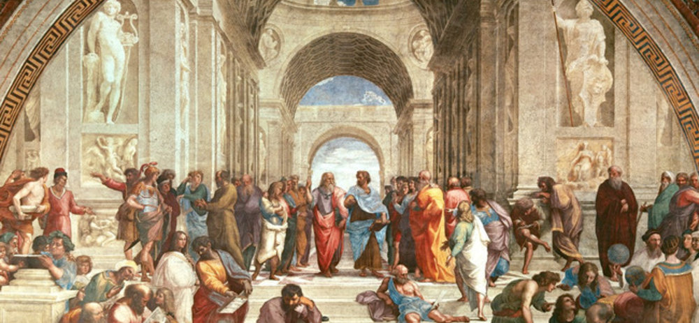

# Applied Data Science @ Columbia

Author: Wenchang Zhu

Email: wz2632@columbia.edu

Project 1: **A "Data Story" on History of Philosophy**


### [Project Description](doc/)
This is the first and only *individual* (as opposed to *team*) project this semester. 

Term: Spring 2023

**Summary**: This dataset was compiled for the Philosophy Data Project and used to develop the features available on that site. The initial goal was to build a classification model with the data. The dataset contains over 300,000 sentences from 59 texts spanning 13 major schools of philosophy. The represented schools are: Analytic Philosophy, Aristotle, Capitalism, Communism, Continental Philosophy, Empiricism, Feminism, German Idealism, Nietzsche, Phenomenology, Plato, Rationalism, and Stoicism.

This data story revolves around **four** questions:

1.   What's the most popular school among these works?
2.   Which school is more concise in expression?
3.   What's the development history of the philosophy schools?
4.   What's the key concept of each school?

**Limitations:**

1.   The dataset is relatively small, so we may lack powerful proof for the questions.
2.   We have no idea how the sentences were selected and whether those sentences were typical or classical for the philosopher/school, so the word clouds of each school may be biased. 

**Conclusion**: In this data story, we figure out in which order these schools appeared. We also roughly indicate people's general belief through "what's the most popular school among 59 philosophers." However, with more works collected, the answer may change. Here we are limited to the size of the dataset. We also dig into the expression way of each school by measuring the degree of concise. For example, philosophers belonging to Plato or Analytics tend to express their ideas in short sentences. However, we do not know whether these sentences are important or not, classical or not, meaningful or not, so we only have a conclusion based on this dataset. Moreover, we create word clouds for each school to seize its key concept, like man or nature. 

```
proj/
├── lib/
├── data/
├── doc/
├── figs/
└── output/
```

Please see each subfolder for a README file.

